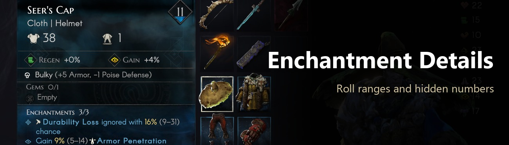
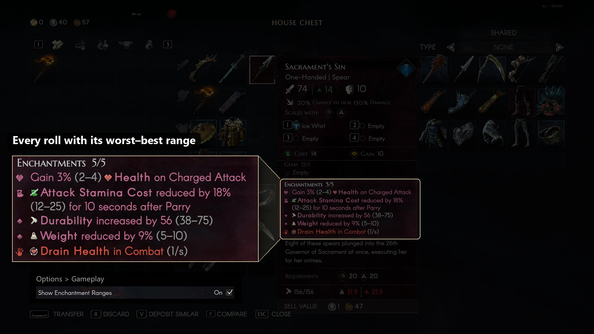
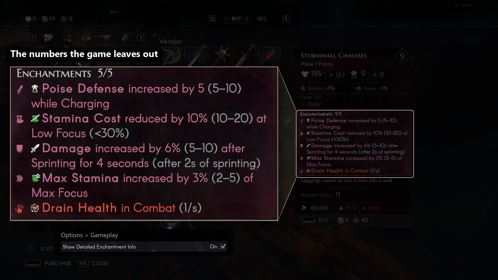
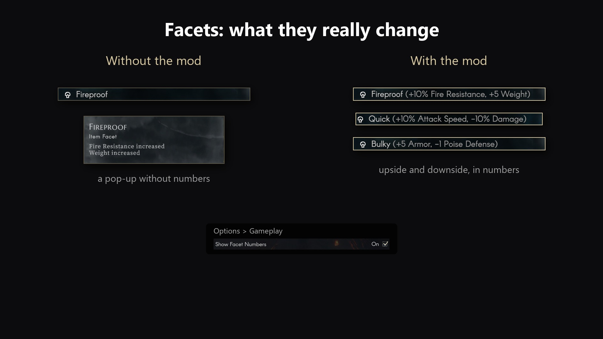
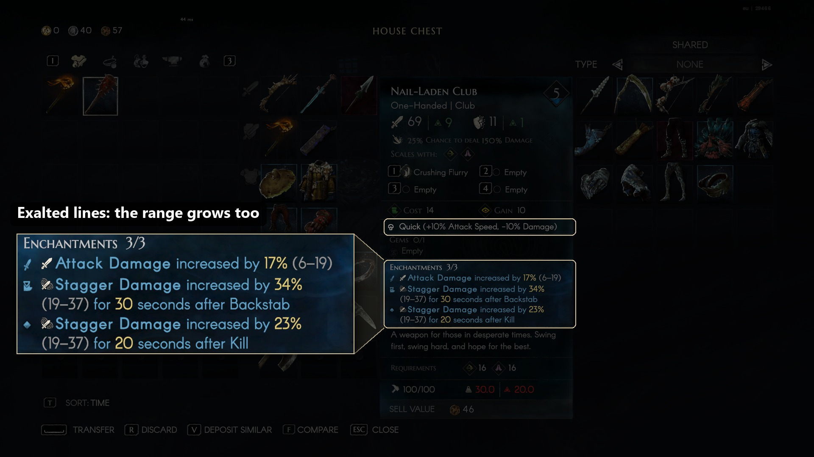
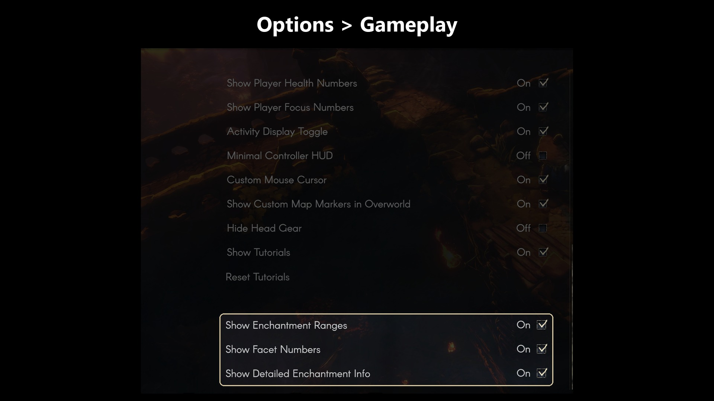

# Enchantment Details

A [MelonLoader](https://github.com/LavaGang/MelonLoader) mod for **No Rest for the Wicked** that shows what your
enchantments, gems and facets really do. You get the range every value can roll in, plus the numbers the game computes
but never prints.

Download: [Nexus Mods](https://www.nexusmods.com/norestforthewicked/mods/106) · [GitHub releases](https://github.com/vergir/NRftW-EnchantmentDetails/releases/latest)

## Features

* **Roll ranges.** Every rolled value shows its worst–best range, so you can see at a glance how good a roll is:
  `Damage increased by 7% (3–10)`. It works on item tooltips, stored enchantments, previews and exalt pop-ups, and it
  follows exalt stacks.
* **Detailed enchantment info.** Many enchantments hide their numbers. The mod adds them:
  * `Drain Health in Combat (1/s)`, `Deal 25% Fire Damage while Blocking (every 1s)`
  * `Gain 20% Lifesteal at Low Health (<50%)`, `Execute Infected Low Health Enemies (<20% HP)`
  * `Healing increased by 20% at Low Focus (<30%)`, `Stamina Cost reduced by 10% at Low Focus (<30%)`
  * `Damage increased by 5% for each Nearby Enemy (max 5, within 7m)`,
    `Damage increased by 10% after Sprinting for 4 seconds (after 2s of sprinting)`
  * `Refill Stamina on Parry (100%)`, `Gain one stack of Furnace … (5s cooldown)`

  This also works on gem tooltips and the enchantment reroll screen.
* **Facet numbers.** Facets show what they change, downside included:
  `Heavy (+20% Damage, +25% Attack Stamina Cost)`, `Durable (+75 Durability, -10% Focus Gain)`. The game's facet pop-up,
  which says the same without numbers, is hidden.

Everything the mod adds is a small grey note, and the game's own text is never changed. Every part can be switched off
with a checkbox at the end of **Options > Gameplay**.

The numbers come straight from the game data at the moment the tooltip is drawn, so they stay correct after balance
patches. The few words the mod adds ("every", "cooldown", "only below", stat names) are English.

## Screenshots







## Install

1. Install [MelonLoader](https://github.com/LavaGang/MelonLoader/releases) **0.7.3** or newer into the game
   (`...\steamapps\common\NoRestForTheWicked`) and start the game once.
2. Put `EnchantmentDetails.dll` into the game's `Mods` folder. The
   [release zip](https://github.com/vergir/NRftW-EnchantmentDetails/releases/latest) already has that layout: extract it
   into the game folder.

### Steam Deck / Linux (Proton)

1. Install MelonLoader into the game folder the same way: copy the files from `MelonLoader.x64.zip` (the Windows build)
   into `~/.local/share/Steam/steamapps/common/NoRestForTheWicked`. Put the mod into `Mods`.
2. In Steam, open the game's **Properties > General > Launch Options** and enter:
   ```
   WINEDLLOVERRIDES="version=n,b" %command%
   ```
3. Start the game. On the first start, MelonLoader downloads and installs the .NET runtime it needs into the Proton
   prefix and generates its assemblies. That first start takes a minute or two.

## Settings file

Everything is also stored in `<game>/UserData/MelonPreferences.cfg`, section `[EnchantmentDetails]`:

| Setting | Default | |
|---|---|---|
| `Enabled` | `true` | Master switch. |
| `ShowRanges` | `true` | Worst–best range after every rolled value (**Show Enchantment Ranges**). |
| `ShowFacetNumbers` | `true` | Facet values, and hide the facet pop-up (**Show Facet Numbers**). |
| `ShowDetailedInfo` | `true` | The numbers enchantment texts leave out (**Show Detailed Enchantment Info**). |
| `AddSettingsRows` | `true` | Add the checkboxes to Options > Gameplay. |
| `Format` | `{value} <color=#9A9A9A>({worst}–{best})</color>` | How a range is written. Placeholders: `{value}`, `{worst}`, `{best}`, `{roll}` (0–100, 100 = best roll). |
| `HiddenFormat` | ` <color=#9A9A9A>({extra})</color>` | How the added numbers are written. |
| `Debug` | `false` | Log every enchantment line the mod processes. |

## Compatibility

* Tested with game build 29466 and MelonLoader 0.7.3 on Windows.
* Display only: nothing in the game simulation or your save is changed, so it does not affect co-op.
* Game updates can move things around. If the mod stops working after an update, check the MelonLoader log
  (`<game>/MelonLoader/Latest.log`) and open an issue.
* Rune details are a separate mod: Rune Details.

## Build

Requires a .NET SDK (6 or newer) and MelonLoader installed in the game, so that `MelonLoader/Il2CppAssemblies` exists.

```
dotnet build -c Release
```

The DLL is copied to `<game>/Mods` after every build. Use `-p:DeployToGame=false` to skip that, or `-p:GameDir=...` if
the game is installed elsewhere. `pwsh ./package.ps1` builds the release zip into `dist/`.

## How it works

See [docs/internal.md](docs/internal.md).

## License

[MIT](LICENSE)
